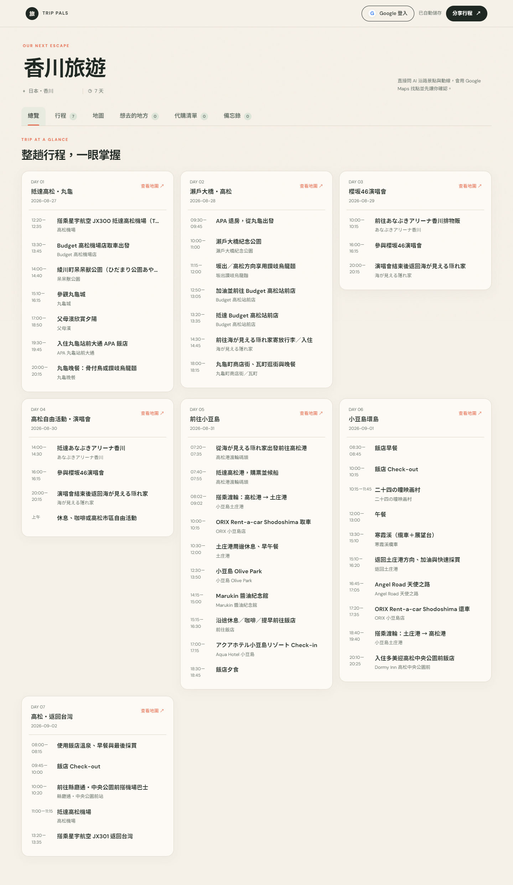
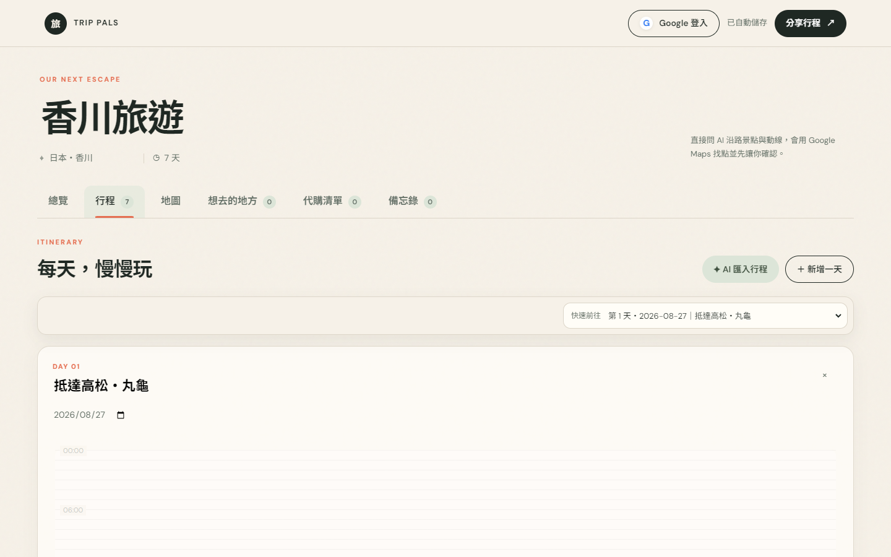
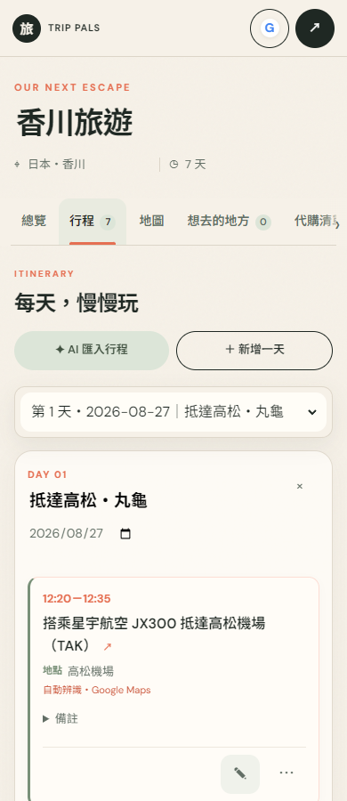

# 旅伴 Trip Pals

旅行行程與代購管理網站，把每日安排、景點收藏、地圖路線、代購進度與備忘錄集中在同一個介面，方便旅伴一起整理旅程。

[線上展示](https://trip-pals-tw.snappy-mite-7937.chatgpt.site) · [架構說明](docs/architecture.md)

## 畫面展示

### 桌機行程總覽



### 每日行程時間軸



### 手機版



## 主要功能

| 功能 | 說明 |
| --- | --- |
| 多旅程管理 | 建立、開啟、重新命名與刪除旅程，整理不同旅行計畫。 |
| 每日行程 | 編輯開始與結束時間、地點與備註；桌機提供拖曳調整，手機使用行程卡片。 |
| 行程總覽 | 依日期瀏覽整趟旅行，查看每日安排與時間衝突提醒。 |
| 景點收藏與地圖 | 收藏想去的地方、補上地圖連結，查看當日地點並開啟 Google Maps 路線。 |
| 行程建議與匯入 | 整理文字或公開 Google Sheet 行程，先預覽建議，再確認套用修改。 |
| 代購清單 | 記錄購買對象、品項、備註與處理狀態。 |
| 備忘錄 | 集中整理旅行提醒與參考資訊。 |
| 登入與分享 | Google 登入後儲存個人旅程；分享連結可讓旅伴開啟並同步編輯。 |
| 響應式介面 | 支援手機、平板與桌機，針對時間軸、導覽與對話框調整版面。 |

## 技術架構

| 範圍 | 技術與用途 |
| --- | --- |
| 應用框架 | Next.js 16、React 19：頁面載入與伺服器 API。 |
| 互動介面 | JavaScript ES Modules、HTML、CSS：時間軸、表單、清單與響應式版面。 |
| 資料儲存 | localStorage：本機旅程；Cloud Firestore：帳號旅程與分享同步。 |
| 登入 | Firebase Authentication、Google 登入。 |
| 地圖 | Google Maps JavaScript API、地圖與路線連結。 |
| 部署 | OpenNext、Cloudflare Workers。 |
| 測試 | Node.js assert、Playwright 操作流程與多尺寸版面測試。 |

目前採用混合架構：Next.js 載入頁面與 API，主要互動介面由 `public/app.js` 管理。詳細資料流程與部署差異見 [架構說明](docs/architecture.md)。

## 本機啟動

使用 Node.js 22 LTS 與 npm。

```bash
git clone https://github.com/n50314/trip-pals.git
cd trip-pals
npm ci
npm run dev
```

開啟 [http://localhost:3000](http://localhost:3000)，即可使用旅程管理、每日行程、景點收藏、代購與備忘錄。首次開啟附有香川範例行程，範例不包含住宿訂單編號。

### 選用服務設定

若要使用外部服務，先將 `.env.example` 複製為 `.env.local`，再填入自己的設定。

```powershell
Copy-Item .env.example .env.local
```

macOS／Linux：

```bash
cp .env.example .env.local
```

| 環境變數 | 用途 |
| --- | --- |
| `OPENAI_API_KEY`、`OPENAI_MODEL` | Next.js 行程建議與匯入端點使用的伺服器設定。 |
| `GEMINI_API_KEY`、`GEMINI_MODEL`、`GEMINI_FALLBACK_MODELS` | Cloudflare Worker 的建議服務與備援模型設定。 |
| `GOOGLE_MAPS_BROWSER_KEY` | 地圖嵌入；未設定時仍可使用外部地圖與路線連結。 |

修改 `.env.local` 後重新啟動開發伺服器。服務金鑰只放在本機環境檔或部署平台的 secrets；地圖 Browser Key 會送到瀏覽器，應設定自己的網域與 API 限制。

本機 `localhost`／`127.0.0.1` 預覽會停用 Firebase 登入與雲端存取，分享使用本機預覽機制。正式網域部署若要使用登入與雲端同步，請建立自己的 Firebase 專案，更新 `public/app.js` 的 `FIREBASE_CONFIG` 與 `.firebaserc`，設定 Google 登入、授權網域及 `firestore.rules`。

## 驗證

```bash
npm run check
npm run test:unit
npm run build
```

操作與版面測試需先啟動本機網站，並安裝 Chrome：

```bash
npm run test:smoke
npm run test:responsive
```

Windows 預設使用 `C:/Program Files/Google/Chrome/Application/chrome.exe`。其他安裝位置可透過 `CHROME_PATH` 指定；`TEST_URL` 可指定測試網址。版面測試涵蓋 320、390、620、768、1024、1440 px 與六個主要面板。

操作測試會模擬部分外部服務回應，測試結果用來驗證介面與資料操作；正式金鑰、第三方服務與跨裝置雲端同步需另外驗證。

## 部署

Node.js 服務：

```bash
npm run build
npm start
```

Cloudflare Workers：

```bash
npm run build:worker
```

依 `wrangler.jsonc` 設定 Worker 名稱、assets 與 service binding，並在自己的部署環境設定服務金鑰。`worker-entry.js` 包含 Worker 端的服務處理，與 Next.js API 的執行路徑有差異。

## 專案結構

```text
app/                    Next.js 頁面、layout 與 API
public/                 互動介面、樣式與時間處理
tests/                  單元、操作流程與響應式測試
docs/                   架構說明與展示截圖
scripts/                OpenNext Worker 打包工具
worker-entry.js         Cloudflare Worker 服務入口
firestore.rules         帳號旅程與分享資料的存取規則
sheet-xlsx.js           試算表內容解析
```
