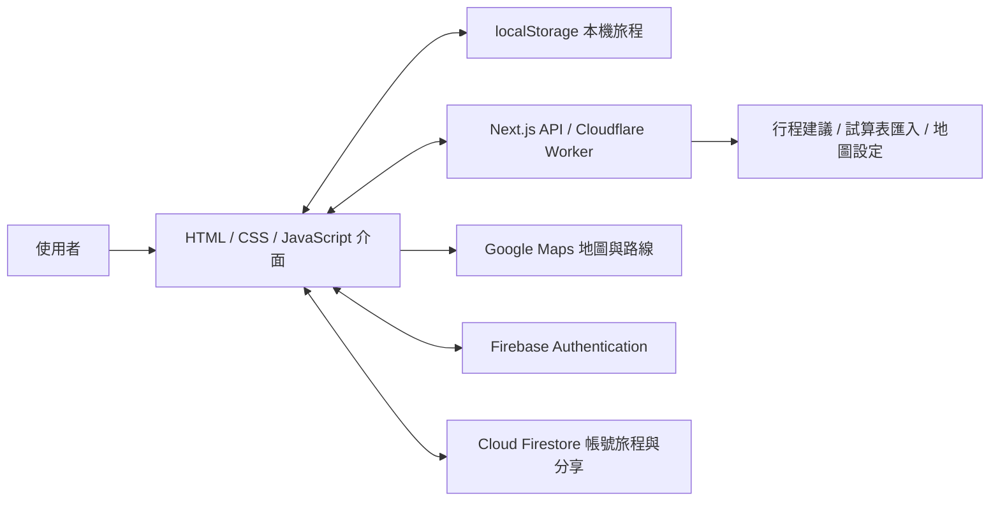

# Trip Pals 架構說明

## 整體資料流程

## 頁面與互動

`app/page.js` 在伺服器讀取 `public/index.html` 的頁面內容，`app/layout.js` 載入共用 CSS 與 JavaScript。`public/app.js` 管理旅程狀態、表單、六個主要面板與畫面更新；`public/trip-time.js` 集中處理時間正規化、排序、時間長度與衝突判斷。

桌機以時間軸呈現每日行程，支援拖曳與長度調整；手機使用可展開的行程卡片。`public/responsive.css` 處理不同尺寸下的導覽、清單、按鈕與對話框。

## 儲存、登入與分享

- 未登入時，旅程保存在瀏覽器 localStorage。
- Google 登入後，個人旅程使用 Firestore 的 `users/{uid}/trips/{tripId}` 路徑。
- 正式環境的分享旅程存放在 `trips/{shareId}`，並透過 Firestore `onSnapshot` 接收更新；短網址由 `shortLinks/{code}` 對應分享 ID。
- 分享連結本身提供該旅程的存取能力，適合交給受信任的旅伴；目前沒有獨立的檢視者／編輯者角色。
- 本機預覽停用 Firebase 存取，使用瀏覽器儲存與本機分享機制，方便無服務金鑰的操作驗證。

`firestore.rules` 對個人旅程檢查登入 UID，對分享資料限制 ID 格式與寫入欄位。分享 ID 的保密性仍是目前分享模式的一部分。

## 服務端與修改確認

`app/api/` 提供行程建議、健檢、對話修改、文字／試算表匯入與地圖設定端點。建議先轉成結構化資料，使用者確認後才套用到行程。

`ai-chat.js` 處理可套用的行程操作與資料驗證；`maps-grounding.js` 驗證地圖來源與景點引用；`sheet-xlsx.js` 解析試算表內容。

Next.js 開發與 Node.js 部署使用 `app/api/`；Cloudflare 部署透過 OpenNext 與 `worker-entry.js` 執行。Worker 另有服務供應者備援與地圖來源處理，兩種執行路徑需分別設定及驗證。

## 測試範圍

| 測試 | 驗證範圍 |
| --- | --- |
| `npm run check` | JavaScript 語法。 |
| `npm run test:unit` | 試算表解析、服務備援、行程操作驗證、地圖來源、時間正規化與衝突。 |
| `npm run test:smoke` | 行程編輯、景點、修改預覽與套用、匯入、地圖備援、清單與本機分享。 |
| `npm run test:responsive` | 六種寬度與六個面板，包含短行程、長文字、鎖定行程、對話框與手機導覽。 |

瀏覽器操作測試使用本機預覽，且部分 API 回應為模擬資料，因此不代表第三方服務或 Firestore 正式環境已通過端到端驗證。
